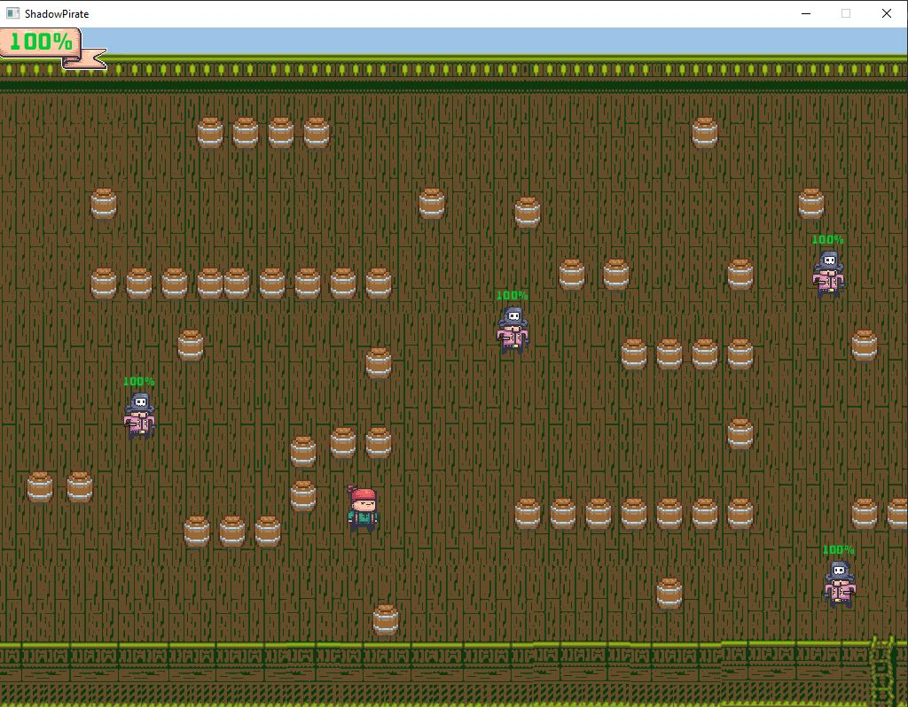
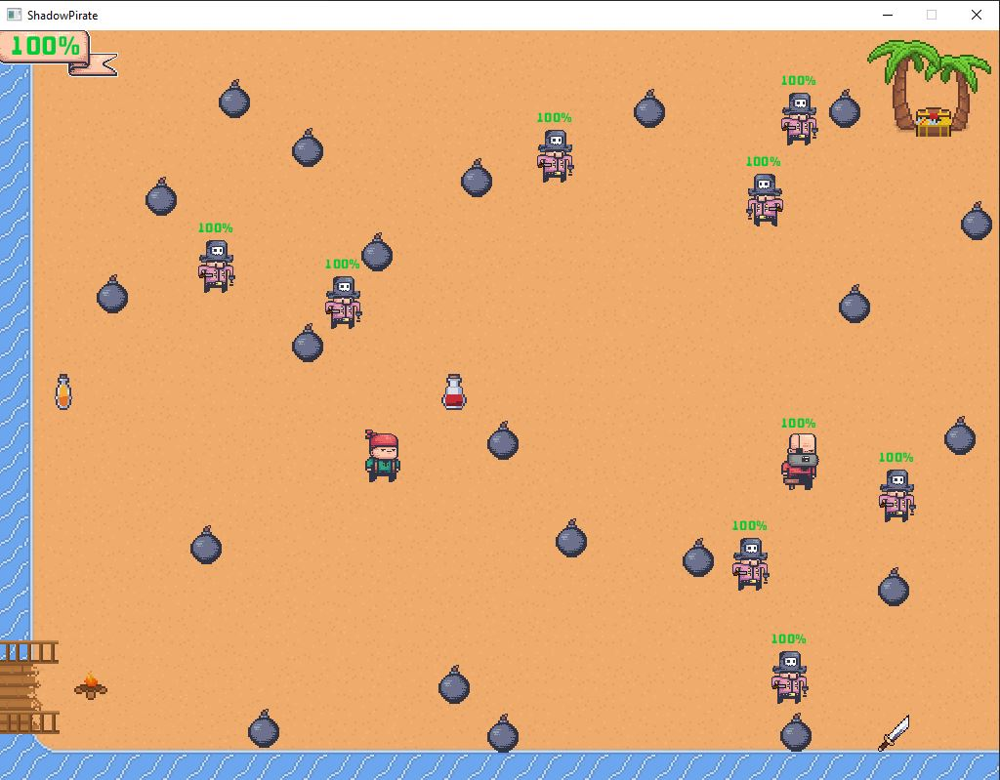
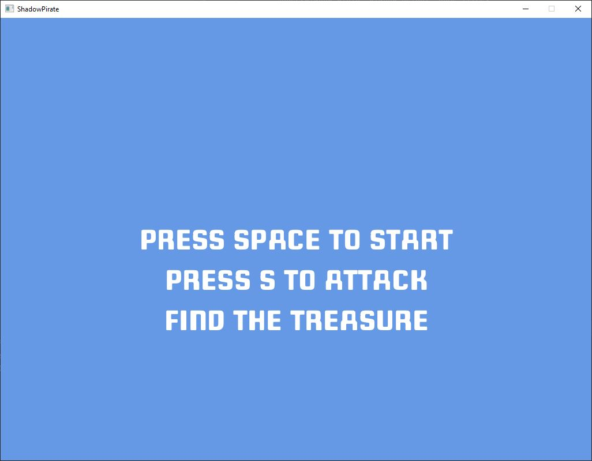

# ShadowPirate Game

A small 2D combat game that has two levels.

The game was given out as a university assignment in [a class](https://handbook.unimelb.edu.au/2022/subjects/swen20003) that taught introductory object-oriented programming using Java. The files *Project 1 Specification.pdf* and *Project 2 Specification.pdf* have all the details.

The graphics functions using a library called [Bagel](https://people.eng.unimelb.edu.au/mcmurtrye/bagel-doc), which was created by a graduate student at the university.

## Controls

Use the arrow keys to move and...

| Key     | Action            |
| ------- | ----------------- |
|  SPACE  | Start level       |
|  ESC    | Exit game         |
|  S      | Attack            |
|  W      | Skip to level two |

## Build and run

1. Download the repository and then open it in a recent version of [IntelliJ IDEA](https://www.jetbrains.com/idea) (or another IDE for working with Java projects).

2. Tell your IDE where the entry point of the program is so that it knows where to run the game from. Here the entry point is in `src/ShadowPirate.java` on line 48. Different IDEs require different setups and so you'll have to [look it up](https://www.baeldung.com/intellij-basics) (sorry).

3. Click the play/run button and the game should start in a new 1024x768 window.

## Sreenshots

Note that the enemies look a bit pixelated since they were moving when the shot was taken.

--------------------------------------
